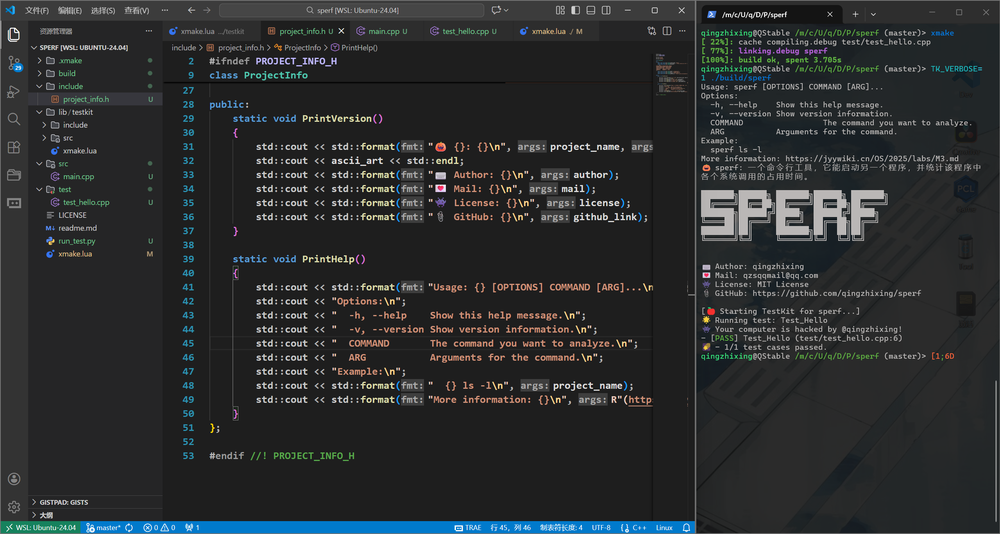
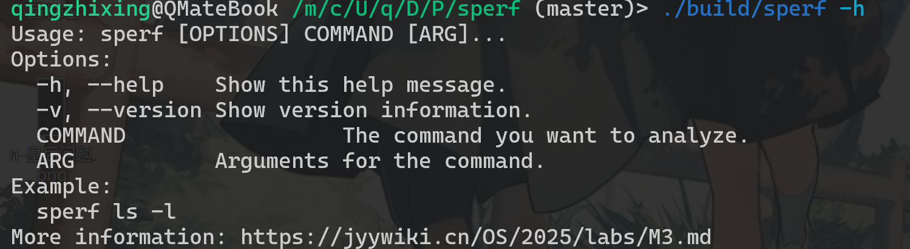
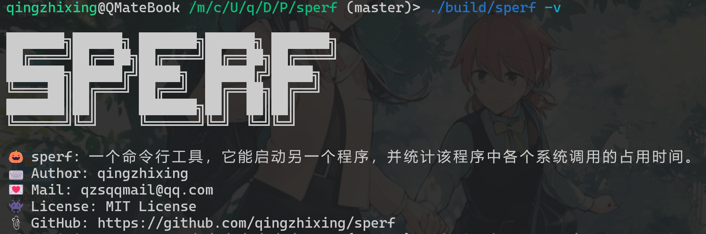
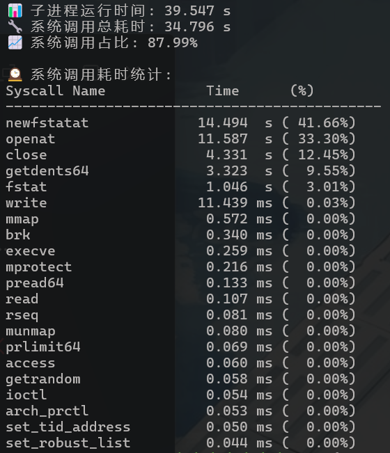

# 🎃 M3: 系统调用 Profiler (sperf)

## ▶️ 介绍

* 一个 Linux 命令行工具，它能启动另一个程序，并统计该程序中各个系统调用的占用时间。
* 基于 `strace` 命令实现，请确保你已安装。

> 更详细的要求: <https://jyywiki.cn/OS/2025/labs/M3.md>



## 💖 展示

* `sperf -h`


* `sperf -v`


* `sperf ls /`


## 🥞 编译运行

* 本项目基于xmake构建
* 请确保你的环境中有 `strace`命令
* 请确保在项目根目录下执行命令

``` bash
xmake
./build/sperf -h
```

## 🔧 运行测试

* 请确保你的环境中有 `python3` 以及相关的库
* 请确保在项目根目录下执行命令

``` bash
./run_test.py
```
